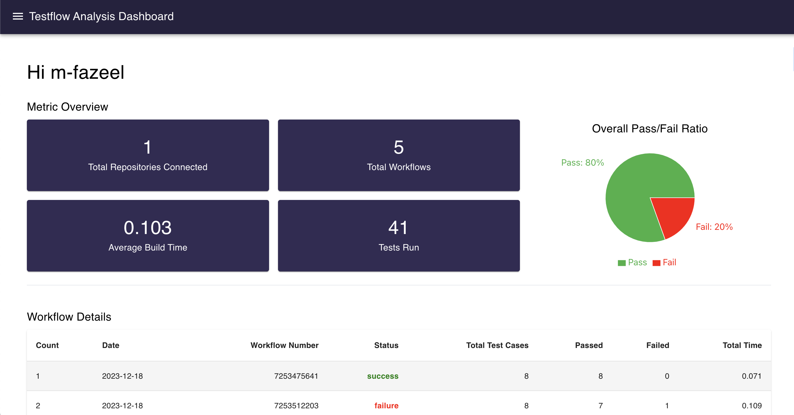
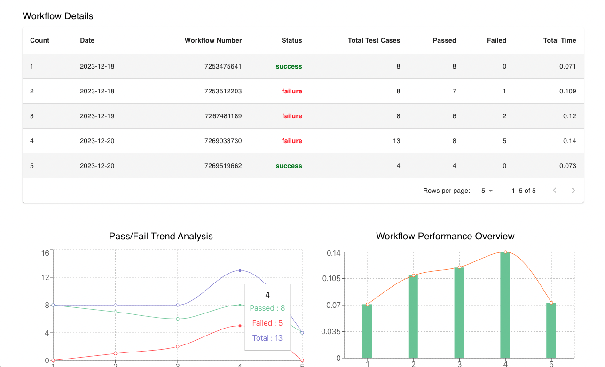

# TestFlow Analysis Dashboard

## Overview
TestFlow Analysis Dashboard is a comprehensive tool designed for monitoring and analyzing software testing and workflow processes. Developed using cutting-edge technologies, this dashboard offers real-time data visualization, enabling users to efficiently track performance metrics and make informed decisions.

## Features
- **Dynamic Data Visualization**: Utilizes Recharts for interactive and intuitive charting solutions.
- **Real-Time Updates**: Integrated with GitHub Actions, webhooks to ensure up-to-date information.
- **User-Friendly Interface**: Built with React.js, Material-UI, and Tailwind CSS for a seamless user experience.
- **Robust Backend**: Powered by Express.js and MongoDB for efficient data handling.

## Technologies Used
- Frontend: React.js, Material-UI, Tailwind CSS
- Backend: Node.js, Express.js, MongoDB
- Data Visualization: Recharts
- Real-Time Processing: GitHub Actions, Webhooks, WebSockets

## Screenshots
<!-- ss1 from frontend -->

<!-- ss2 from frontend -->

## Copyright
This software is provided for educational purposes only. It is prohibited to use this code, for any college assignment or personal use. Unauthorized distribution, modification or commercial usage is strictly forbidden. Please respect the rights of the author.
